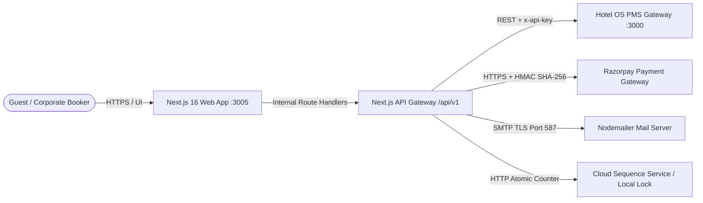
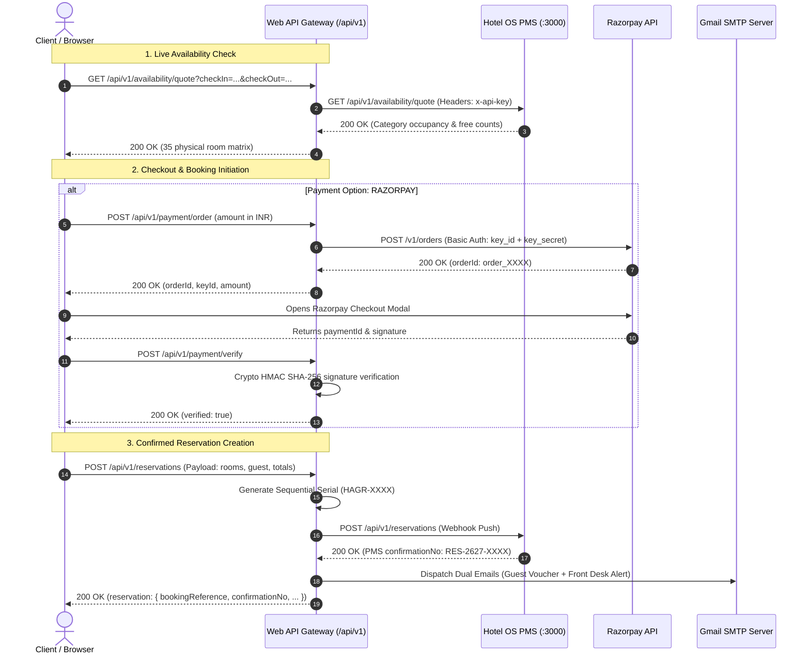
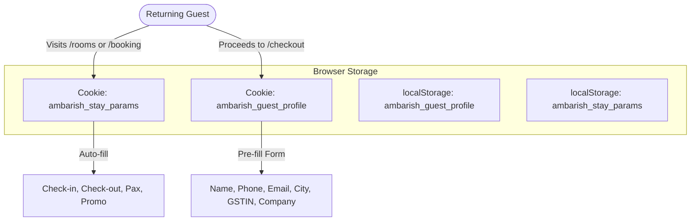

# TECHNICAL SPECIFICATION DOCUMENT (TSD)
## Digital Hospitality Web Platform & PMS Integration Engine

**System:** Hotel Ambarish Grand Residency Web Platform & API Gateway  
**Property:** Hotel Ambarish Grand Residency by Divine View  
**Address:** Md Shah Road, Paltan Bazaar, Guwahati, Assam — 781008, India  
**Document Version:** 2.4 (Production Release)  
**Primary Port Assignments:** Frontend App (`3005`) | Hotel OS PMS (`3000`)  
**Target Runtimes:** Next.js 16 App Router / React 19 / Node.js 22  

---

## 1. Executive Summary & System Objectives

The **Hotel Ambarish Digital Hospitality Platform** is an enterprise-grade web application engineered to drive direct, commission-free reservations, showcase property accommodations and banquet venues, and provide seamless bi-directional integration with **Hotel OS** (the on-premise/cloud Property Management System).



### Core Business & Technical Objectives
1. **Direct Booking Engine**: Streamline guest room selection (bed types, meal plans, extra pax) and complete reservations via Instant Online Payment (Razorpay) or Pay-At-Hotel settlement.
2. **Physical Inventory Enforcement**: Strictly guard the hotel’s fixed **35 physical room inventory** across Floors 2 to 6, preventing overbooking.
3. **Automated PMS Ingestion**: Forward confirmed reservations, corporate rate contract inquiries, and banquet RFPs directly into Hotel OS with zero manual front-desk transcription.
4. **Resilient Offline Fallback**: Guarantee that guests are never turned away or shown unhandled runtime exceptions if the local PMS gateway is temporarily unreachable.
5. **Statutory Tax Compliance**: Automatically compute Indian Goods and Services Tax (GST) under **SAC 996311** (5% vs. 18% tiers) and capture 15-digit corporate GSTINs for Input Tax Credit (ITC).

---

## 2. Technology Stack & Runtime Architecture

| Layer | Technology | Version | Purpose |
| :--- | :--- | :--- | :--- |
| **Framework** | Next.js (App Router) | `16.3.3` | Hybrid Static Generation (SSG), Server-Side Rendering (SSR), and Edge/Node Route Handlers |
| **UI Library** | React / React DOM | `19.0.0` | Declarative component UI architecture with React Server Components (RSC) |
| **Language** | TypeScript | `5.7.3` | End-to-end type safety, strict interface enforcement, and data schemas |
| **Styling** | Tailwind CSS | `3.4.17` | Atomic CSS engine customized with the Ambarish Spec 2.1 design token system |
| **3D Visualization** | Three.js / R3F / Drei | `0.185.1` / `9.7.0` | Interactive spatial room visualizers and 3D architectural tilt perspectives |
| **Icons & Motion** | Lucide React / Framer Motion | `1.38.0` / `13.1.1` | Accessible vector iconography and fluid micro-interactions |
| **Payments** | Razorpay Node SDK / Web API | Web API / v1 | INR payment order generation and HMAC SHA-256 webhook signature verification |
| **Email Subsystem** | Nodemailer | `9.1.0` | SMTP client dispatching multi-part MIME HTML booking vouchers and team alerts |
| **CSS Processing** | PostCSS / Autoprefixer | `8.5.3` / `10.4.20` | Vendor prefixing and CSS optimization |

---

## 3. Physical Inventory & Capacity Specification

The hotel operates **35 physical rooms** across floors 2 through 6. The booking engine enforces strict capacity ceilings based on physical room numbers:

```
                  ┌──────────────────────────────────────────────┐
  FLOOR 6 (6 Rms) │ 601(T), 602(T), 604(K), 605(K), 606(T), 607(T) [All Exec]  │
                  ├──────────────────────────────────────────────┤
  FLOOR 5 (7 Rms) │ 501(D-K), 502(SUI), 503(E-K), 504(D-T), 505(D-T), 506(D-T), 507(SUI) │
                  ├──────────────────────────────────────────────┤
  FLOOR 4 (10 Rms)│ 401(T), 402(T), 403(T), 404(K), 405(K), 406(K), 408(T)-411(T) [All Dlx]│
                  ├──────────────────────────────────────────────┤
  FLOOR 3 (10 Rms)│ 301(D-T), 302(D-T), 303-306(D-K), 308(D-T), 309(E-T), 310-311(D-T)  │
                  ├──────────────────────────────────────────────┤
  FLOOR 2 (2 Rms) │ 206(D-K), 207(D-K)                           │
                  └──────────────────────────────────────────────┘
```

### Physical Inventory Allocation Matrix

| Room Category | Code | Bed Configuration | Total Physical Rooms | Room Numbers by Floor | Max Occupancy | Base EP Tariff |
| :--- | :--- | :--- | :--- | :--- | :--- | :--- |
| **Double Deluxe Room** | `DLX` | **King Bed** | **10** | **Fl 2:** 206, 207<br>**Fl 3:** 303, 304, 305, 306<br>**Fl 4:** 404, 405, 406<br>**Fl 5:** 501 | 2 Adults, 1 Child | ₹2,000 |
| **Double Deluxe Room** | `DLX` | **Twin Beds** | **15** | **Fl 3:** 301, 302, 308, 310, 311<br>**Fl 4:** 401, 402, 403, 408, 409, 410, 411<br>**Fl 5:** 504, 505, 506 | 2 Adults, 1 Child | ₹2,000 |
| **Executive Room** | `EXE` | **King Bed** | **3** | **Fl 5:** 503<br>**Fl 6:** 604, 605 | 2 Adults, 1 Child | ₹2,500 |
| **Executive Room** | `EXE` | **Twin Beds** | **5** | **Fl 3:** 309<br>**Fl 6:** 601, 602, 606, 607 | 2 Adults, 1 Child | ₹2,500 |
| **Presidential Suite** | `SUI` | **Master King Bed** | **2** | **Fl 5:** 502, 507 | 3 Adults, 2 Children | ₹3,500 |
| **TOTALS** | — | — | **35 Rooms** | **5 Floors (Floors 2 to 6)** | — | — |

---

## 4. Rate Plans & Pricing Computation Engine

### 4.1 Rate Plan Configurations
1. **European Plan (`EP`)**: Room Only (Complimentary high-speed Wi-Fi, mineral water bottle, electric kettle).
2. **Continental Plan (`CP`)**: Inclusive of multi-cuisine buffet breakfast served at The Ambarish Restaurant (07:30 AM to 10:30 AM).
3. **Modified American Plan (`MAP`)**: Inclusive of buffet breakfast and chef's choice dinner (special groups/corporate contracts).

| Category | Plan Code | Plan Name | Price per Night |
| :--- | :--- | :--- | :--- |
| **Double Deluxe Room** | `EP`<br>`CP` | European Plan (Room Only)<br>Continental Plan (With Buffet Breakfast) | ₹2,000<br>₹2,400 |
| **Executive King Room** | `EP`<br>`CP` | European Plan (Room Only)<br>Continental Plan (With Buffet Breakfast) | ₹2,500<br>₹2,950 |
| **Presidential Luxury Suite**| `EP`<br>`CP` | European Plan (Room Only)<br>Continental Plan (With Buffet Breakfast) | ₹3,500<br>₹4,100 |

### 4.2 Indian Statutory GST Calculation Engine (SAC 996311)
Implemented in [`src/lib/gst.ts`](file:///d:/kachra/Downloads/My%20Projects/Ambarish%20Website/src/lib/gst.ts):

$$\text{Tax Rate} = \begin{cases} 5\% \ (\text{CGST } 2.5\% + \text{SGST } 2.5\%) & \text{if } \text{Tariff} \le ₹7,500/\text{night} \\ 18\% \ (\text{CGST } 9.0\% + \text{SGST } 9.0\%) & \text{if } \text{Tariff} > ₹7,500/\text{night} \end{cases}$$

```ts
export function calculateRoomGST(tariffPerNight: number, nights: number = 1, isInclusive: boolean = false): GSTBreakdown {
  const sacCode = "996311";
  const taxRate = tariffPerNight > 7500 ? 0.18 : 0.05;
  const cgstRate = taxRate / 2;
  const sgstRate = taxRate / 2;

  const baseAmount = tariffPerNight * nights;
  const totalTax = Math.round(baseAmount * taxRate);
  const totalAmount = baseAmount + totalTax;

  const cgst = Math.round((totalTax / 2) * 100) / 100;
  const sgst = Math.round((totalTax - cgst) * 100) / 100;

  return { baseAmount, taxRate, cgstRate, sgstRate, cgst, sgst, totalTax, totalAmount, sacCode };
}
```

### 4.3 Promotional Discount Engine
Implemented in [`src/data/promos.ts`](file:///d:/kachra/Downloads/My%20Projects/Ambarish%20Website/src/data/promos.ts):

| Promo Code | Discount Model | Value | Criteria | Description |
| :--- | :--- | :--- | :--- | :--- |
| `DIRECT10` | Percentage | 10% | No minimum spend | Direct Booking Web Special |
| `AMBARISH15` | Percentage | 15% | No minimum spend | Grand Residency Direct Discount |
| `WELCOME500` | Flat Credit | ₹500 | Min. base ₹2,500 | Welcome Guest Credit |
| `DIVINE20` | Percentage | 20% | Executive & Suite | Divine View Privilege Discount |

---

## 5. Sequential Reservation Reference Generator (`HAGR-XXXX`)

Implemented in [`src/lib/sequence.ts`](file:///d:/kachra/Downloads/My%20Projects/Ambarish%20Website/src/lib/sequence.ts). Guarantees strictly sequential, non-colliding booking numbers across serverless container restarts and multi-region runtimes:

```
[Incoming Reservation]
        │
        ▼
[Tier 1: Cloud Counter Endpoint (Abacus KV)] ──(Success)──► Return HAGR-XXXX
        │ (Network Failure / Offline)
        ▼
[Tier 2: Global Memory Scope (globalThis.__HAGR_RESERVATION_COUNTER__)]
        │ (Cold Start / Empty)
        ▼
[Tier 3: Local Atomic Persistent File (data/reservation-counter.json)]
        │ (System Lock / Missing)
        ▼
[Tier 4: Guaranteed Ephemeral Seed + Random Nonce] ──► Return HAGR-XXXX
```

- **Format:** `HAGR-` followed by a 4-digit zero-padded integer (e.g., `HAGR-0001`, `HAGR-0042`).
- **Initial Baseline Offset:** Configurable via `START_RESERVATION_SEQUENCE` (defaults to `1` $\to$ `HAGR-0001`).

---

## 6. API Gateway Specifications (`/api/v1/*`)

All API routes run as Next.js server route handlers within [`src/app/api/v1`](file:///d:/kachra/Downloads/My%20Projects/Ambarish%20Website/src/app/api/v1).



---

### Endpoint 1: Live Room Availability
* **Route:** `GET /api/v1/availability/quote`
* **Query Parameters:** `checkIn` (`YYYY-MM-DD`), `checkOut` (`YYYY-MM-DD`)
* **Behavior:** Proxies request to Hotel OS PMS. Falls back to static 35-room inventory if PMS is unreachable.

#### Response (`200 OK`)
```json
{
  "arrivalDate": "2026-09-15",
  "departureDate": "2026-09-18",
  "totalRooms": 35,
  "availableRooms": 35,
  "categories": [
    {
      "roomTypeId": "rt_deluxe_king",
      "roomTypeCode": "DELUXE_KING",
      "roomTypeName": "Double Deluxe Room (King)",
      "totalRooms": 10,
      "occupiedOrBlocked": 0,
      "availableCount": 10,
      "capacity": 3
    },
    {
      "roomTypeId": "rt_deluxe_twin",
      "roomTypeCode": "DELUXE_TWIN",
      "roomTypeName": "Double Deluxe Room (Twin)",
      "totalRooms": 15,
      "occupiedOrBlocked": 0,
      "availableCount": 15,
      "capacity": 3
    },
    {
      "roomTypeId": "rt_exec_king",
      "roomTypeCode": "EXEC_KING",
      "roomTypeName": "Executive Room (King)",
      "totalRooms": 3,
      "occupiedOrBlocked": 0,
      "availableCount": 3,
      "capacity": 3
    },
    {
      "roomTypeId": "rt_exec_twin",
      "roomTypeCode": "EXEC_TWIN",
      "roomTypeName": "Executive Room (Twin)",
      "totalRooms": 5,
      "occupiedOrBlocked": 0,
      "availableCount": 5,
      "capacity": 3
    },
    {
      "roomTypeId": "rt_suite",
      "roomTypeCode": "SUITE",
      "roomTypeName": "Presidential Luxury Suite",
      "totalRooms": 2,
      "occupiedOrBlocked": 0,
      "availableCount": 2,
      "capacity": 4
    }
  ]
}
```

---

### Endpoint 2: Create Direct Reservation
* **Route:** `POST /api/v1/reservations`
* **Headers:** `Content-Type: application/json`

#### Request Payload
```json
{
  "checkIn": "2026-09-15",
  "checkOut": "2026-09-18",
  "nights": 3,
  "rooms": 2,
  "adults": 4,
  "children": 0,
  "bookingType": "INDIVIDUAL",
  "bookedRooms": [
    {
      "roomSlug": "deluxe-room",
      "roomName": "Double Deluxe Room",
      "categoryCode": "DLX",
      "bedType": "King Bed",
      "ratePlanCode": "EP",
      "ratePlanName": "European Plan (Room Only)",
      "pricePerNight": 2000,
      "quantity": 1
    },
    {
      "roomSlug": "deluxe-room",
      "roomName": "Double Deluxe Room",
      "categoryCode": "DLX",
      "bedType": "Twin Bed",
      "ratePlanCode": "CP",
      "ratePlanName": "Continental Plan (With Buffet Breakfast)",
      "pricePerNight": 2400,
      "quantity": 1
    }
  ],
  "guestName": "BIJESH SHARMA",
  "guestPhone": "09876543210",
  "guestEmail": "bijesh@example.com",
  "guestCity": "GUWAHATI",
  "guestState": "ASSAM",
  "guestGstin": "18AAAAA0000A1Z5",
  "companyName": "SHARMA ENTERPRISES",
  "specialRequests": "High floor room facing away from street",
  "promoCode": "DIRECT10",
  "discountAmount": 1320,
  "baseAmount": 11880,
  "taxAmount": 594,
  "totalAmount": 12474,
  "paymentMethod": "PAY_AT_HOTEL",
  "paymentId": "PAY_AT_HOTEL"
}
```

#### Response (`200 OK`)
```json
{
  "success": true,
  "reservation": {
    "bookingReference": "HAGR-0001",
    "confirmationNo": "HAGR-0001",
    "status": "CONFIRMED",
    "createdAt": "2026-09-07T10:30:00.000Z",
    "guestName": "BIJESH SHARMA",
    "guestPhone": "09876543210",
    "guestEmail": "bijesh@example.com",
    "checkIn": "2026-09-15",
    "checkOut": "2026-09-18",
    "nights": 3,
    "rooms": 2,
    "totalAmount": 12474,
    "paymentMethod": "PAY_AT_HOTEL"
  }
}
```

---

### Endpoint 3: Razorpay Payment Order Generation
* **Route:** `POST /api/v1/payment/order`
* **Headers:** `Content-Type: application/json`

#### Request
```json
{
  "amount": 12474,
  "currency": "INR",
  "receipt": "rcpt_hagr_1725700000",
  "notes": {
    "property": "Hotel Ambarish Grand Residency",
    "room": "Double Deluxe Room"
  }
}
```

#### Response (`200 OK`)
```json
{
  "success": true,
  "orderId": "order_Ox84JkL23Npa",
  "amount": 1247400,
  "currency": "INR",
  "receipt": "rcpt_hagr_1725700000",
  "keyId": "rzp_live_xxxxxxxxxxxx"
}
```

---

### Endpoint 4: Razorpay HMAC Signature Verification
* **Route:** `POST /api/v1/payment/verify`
* **Verification Logic:**
$$\text{Generated Signature} = \text{HMAC-SHA256}(\text{order\_id} + "|" + \text{payment\_id}, \ \text{RAZORPAY\_KEY\_SECRET})$$

#### Request
```json
{
  "razorpay_order_id": "order_Ox84JkL23Npa",
  "razorpay_payment_id": "pay_Ox86Mbz98Klc",
  "razorpay_signature": "5f2d4e8c7b6a1e3..."
}
```

#### Response (`200 OK`)
```json
{
  "success": true,
  "verified": true,
  "paymentId": "pay_Ox86Mbz98Klc",
  "orderId": "order_Ox84JkL23Npa"
}
```

---

### Endpoint 5: Corporate & Travel Agent B2B Inquiry
* **Route:** `POST /api/v1/b2b/enquiry`
* **Purpose:** Direct CRM ingestion for contracted corporate accounts, GST billing preferences, and room allocations.

#### Request
```json
{
  "companyName": "OIL INDIA LIMITED",
  "accountType": "CORPORATE",
  "contactPerson": "DEBAJIT SARMA",
  "designation": "Head of Corporate Administration",
  "email": "traveldesk@oilindia.in",
  "phone": "09864012345",
  "gstin": "18AABCO1234F1ZX",
  "city": "DULIAJAN",
  "state": "ASSAM",
  "estimatedMonthlyRoomNights": 45,
  "requiredMealPlans": ["EP", "CP"],
  "billingPreference": "BILL_TO_COMPANY",
  "message": "Requesting annual contracted rate for transit executives."
}
```

---

### Endpoint 6: Banquet & Meeting RFP Inquiry
* **Route:** `POST /api/v1/events/enquiry`
* **Purpose:** Lead generation for conferences, seminars, banquets, and social events (150 max capacity).

#### Request
```json
{
  "eventType": "Corporate Conference",
  "eventTitle": "Regional Energy Leadership Symposium",
  "eventDate": "2026-10-25",
  "attendees": 80,
  "seatingLayout": "Theatre Style",
  "name": "Pranab Barua",
  "email": "pranab@company.com",
  "phone": "09864098765",
  "notes": "Requires high-definition projection, wireless mics, and buffet lunch."
}
```

---

## 7. Hotel OS PMS Integration Contract & Resilience

Client implementation located in [`src/lib/hotel-os-client.ts`](file:///d:/kachra/Downloads/My%20Projects/Ambarish%20Website/src/lib/hotel-os-client.ts).

### 7.1 PMS Webhook Push Payload
When a direct booking completes on the website, the server dispatches a structured webhook push to `POST ${PMS_API_URL}/reservations`:

```json
{
  "propertyId": "prop_ambarish",
  "source": "WEBSITE",
  "channelRef": "WEB-784921",
  "bookingType": "INDIVIDUAL",
  "checkIn": "2026-09-15",
  "checkOut": "2026-09-18",
  "nights": 3,
  "rooms": 2,
  "adults": 4,
  "children": 0,
  "bookedRooms": [
    {
      "categoryCode": "DELUXE_KING",
      "roomName": "Double Deluxe Room",
      "bedType": "King Bed",
      "ratePlanCode": "EP",
      "pricePerNight": 2000,
      "quantity": 1
    }
  ],
  "guestName": "BIJESH SHARMA",
  "guestPhone": "09876543210",
  "guestEmail": "bijesh@example.com",
  "baseAmount": 11880,
  "taxAmount": 594,
  "totalAmount": 12474,
  "paymentMethod": "PAY_AT_HOTEL",
  "depositAmount": 0
}
```

### 7.2 Zero-Drop Resilience Protocol (Hospitality Fallback)
Hospitality systems cannot afford checkout transaction drops due to network partitions between web hosting (e.g., Vercel) and on-premise PMS gateways.

```
[Booking Post Request to PMS]
            │
      (8s Timeout Controller)
            │
    ┌───────┴───────┐
 (PMS 200 OK)  (PMS Offline / Timeout)
    │               │
Extract PMS No  Generate Guaranteed Fallback No:
(RES-2627-XXXX) RES-{YYMMDD}-{RANDOM_4}
    │               │
    └───────┬───────┘
            ▼
Persist Confirmation & Trigger NodeMailer Dual Email
```

---

## 8. Client-Side Session & State Architecture

Implemented in [`src/lib/session.ts`](file:///d:/kachra/Downloads/My%20Projects/Ambarish%20Website/src/lib/session.ts). Uses dual-storage (`document.cookie` with `localStorage` fallback) with a 7-day TTL and `SameSite=Lax` policy.



### Stored State Attributes
1. **`ambarish_guest_profile`**:
   - `guestName`: Auto-converted to uppercase
   - `guestEmail`: Trimmed lowercase email
   - `guestPhone`: Normalized 10-digit number
   - `guestCity` / `guestState`: Address details
   - `companyName` & `guestGstin`: Corporate tax identifiers
   - `specialRequests`: Smoking preference, floor preferences, transit requests

2. **`ambarish_stay_params`**:
   - `checkIn` & `checkOut`: ISO date strings (`YYYY-MM-DD`)
   - `rooms`, `adults`, `children`: Integer counts
   - `promoCode`: Active promo voucher token

---

## 9. Transactional Email & Messaging Architecture

Implemented in [`src/lib/email.ts`](file:///d:/kachra/Downloads/My%20Projects/Ambarish%20Website/src/lib/email.ts) via Nodemailer over SMTP TLS.

### 9.1 Dispatch Rules & Dual Delivery
Every confirmed reservation triggers two parallel email dispatches:
1. **Hotel Operations Notification** $\to$ Sent to `reservation.ambarish@gmail.com`
   - Complete booking metadata, room night breakdown, guest contact details, GST billing data, and special requests.
2. **Guest Confirmation Voucher** $\to$ Sent to guest email address
   - Clean, branded, printable HTML voucher featuring confirmation reference, check-in instructions, cancellation rules, directions, and hotel direct emergency desk numbers (`088220 41211` / `+91 361 273 4500`).

### 9.2 Vercel Serverless Lambda Execution Guard
In serverless runtimes, asynchronous background promises can freeze if the response finishes before I/O completion. The route handler explicitly `await`s the email transporter promises:

```ts
// Await email delivery so serverless lambda does not freeze prematurely
try {
  await sendReservationNotificationEmails({
    confirmationNo,
    ...body,
  });
} catch (mailErr: any) {
  console.error("[Reservation Email] Dispatch warning:", mailErr?.message);
}
```

---

## 10. Design System & Frontend Tokens (Spec 2.1)

Configured in [`tailwind.config.ts`](file:///d:/kachra/Downloads/My%20Projects/Ambarish%20Website/tailwind.config.ts) and [`src/app/globals.css`](file:///d:/kachra/Downloads/My%20Projects/Ambarish%20Website/src/app/globals.css).

```
 ┌──────────────┐   ┌──────────────┐   ┌──────────────┐   ┌──────────────┐   ┌──────────────┐
 │     Ink      │   │ Warm Cream   │   │  Hotel Gold  │   │Brand Magenta │   │   Charcoal   │
 │   #0C0B0B    │   │   #F5EBDD    │   │   #B4872F    │   │   #B62576    │   │   #171414    │
 └──────────────┘   └──────────────┘   └──────────────┘   └──────────────┘   └──────────────┘
   Primary Dark       Primary Canvas     Borders/Accents    Primary Action      Dark Surfaces
```

### 10.1 Token System
* **Ink (`#0C0B0B`)**: Deepest black for headers, footers, typography, and contrast backdrops.
* **Warm Cream (`#F5EBDD`)**: Primary ambient background canvas.
* **Warm Cream Alt (`#ECE1D0`)**: Elevated section background and subtle strip alternating cards.
* **Hotel Gold (`#B4872F`)**: Refined metallic gold for thin borders, badges, stars, and dividers.
* **Brand Magenta (`#B62576`)**: High-converting action accent used selectively for direct booking buttons and key CTA interactions.
* **Charcoal (`#171414`)**: Secondary dark surface for modal popups and card sheets.

### 10.2 Typography Matrix
* **Display Serif**: `Cormorant Garamond` (Google Fonts via `next/font/google`). Used for editorial headings, hero titles, and rates.
* **Interface Sans**: `Inter` (Google Fonts via `next/font/google`). Used for forms, data tables, booking engine inputs, body copy, and badges.

---

## 11. Interactive 3D Spatial Room Visualization

Components located in [`src/components/3d`](file:///d:/kachra/Downloads/My%20Projects/Ambarish%20Website/src/components/3d):
* **`RoomSpatial3D.tsx`**: Uses `@react-three/fiber` and `@react-three/drei` to render real-time perspective representations of room layouts (Double Deluxe King vs Twin layouts, Presidential Suite separation between living and master suites).
* **`CardTilt3D.tsx`**: Provides dynamic hardware-accelerated gyro and mouse-coordinate parallax tilt for room selection cards.

---

## 12. Security, Compliance & SEO Architecture

### 12.1 SEO & Schema.org Structured Data
Configured in [`src/app/layout.tsx`](file:///d:/kachra/Downloads/My%20Projects/Ambarish%20Website/src/app/layout.tsx):
* **Canonical URLs**: `https://hotelambarish.com`
* **JSON-LD Schema**: Full `Hotel` / `LodgingBusiness` structured data schema with coordinates (`lat: 26.1824, lng: 91.7516`), check-in/out hours, star rating (`3`), and contact points.
* **Sitemap & Robots**: Dynamically generated via Next.js route handlers `sitemap.ts` and `robots.ts`.
* **OpenGraph & Twitter Cards**: High-resolution WebP hero images for social previews.

### 12.2 Security Hardening
1. **Payment Security**: Razorpay private secrets are never exposed to the client bundle (`RAZORPAY_KEY_SECRET` resides strictly in server-side route handlers).
2. **Server Configuration**: Environment variables are sanitized via [`src/lib/config.ts`](file:///d:/kachra/Downloads/My%20Projects/Ambarish%20Website/src/lib/config.ts) to strip erroneous quotes or whitespace.
3. **Data Normalization**: Guest names, cities, and corporate titles are normalized (`.toUpperCase()`) to conform with hotel hospitality registry standards.
4. **GSTIN Validation**: Enforces 15-character Indian Goods and Services Tax Identification Number formatting with State Code validation (`18` for Assam).

---

## 13. Environment Configuration & Deployment Topology

### 13.1 Environment Variable Schema (`.env.local`)
```env
# ===================================================
# HOTEL OS PROPERTY MANAGEMENT SYSTEM (PMS) GATEWAY
# ===================================================
PMS_API_URL=http://localhost:3000/api/v1
PMS_API_SECRET=ambarish_pms_secret_2026
PMS_PROPERTY_ID=prop_ambarish

# ===================================================
# RAZORPAY PAYMENT GATEWAY CREDENTIALS
# ===================================================
NEXT_PUBLIC_RAZORPAY_KEY_ID=rzp_test_xxxxxx
RAZORPAY_KEY_ID=rzp_test_xxxxxx
RAZORPAY_KEY_SECRET=your_razorpay_secret_key_here

# ===================================================
# TRANSACTIONAL EMAIL NOTIFICATION ENGINE (SMTP)
# ===================================================
NOTIFICATION_EMAIL=reservation.ambarish@gmail.com
SMTP_HOST=smtp.gmail.com
SMTP_PORT=587
SMTP_USER=reservation.ambarish@gmail.com
SMTP_PASS=your_gmail_app_password_here

# ===================================================
# APPLICATION HOSTING CONFIGURATION
# ===================================================
NEXT_PUBLIC_APP_URL=http://localhost:3005
START_RESERVATION_SEQUENCE=1
```

### 13.2 Build & Execution Scripts
```bash
# Run local development server on Port 3005
npm run dev

# Compile production-ready standalone build
npm run build

# Launch production server on Port 3005
npm run start

# Execute ESLint verification
npm run lint
```

---

## 14. Verification & Pre-Flight Quality Assurance Runbook

Before deploying updates to production, verify each of the following capabilities:

- [x] **Physical Room Inventory Ceilings**: System limits King Bed selections to 10 rooms and Twin Bed selections to 15 rooms for Double Deluxe.
- [x] **Rate Plan Math**: Selecting Continental Plan (`CP`) adds the exact meal surcharge before tax calculation.
- [x] **SAC 996311 GST Math**: Room bills under ₹7,500/night calculate 5% total tax (split evenly into 2.5% CGST + 2.5% SGST).
- [x] **Sequential Numbering**: Confirmed bookings yield sequential `HAGR-XXXX` identifiers without gaps or duplicate references.
- [x] **Razorpay Cryptographic Signature**: Server correctly validates HMAC SHA-256 signatures before confirming prepaid bookings.
- [x] **Pay-At-Hotel Path**: Offline booking option completes successfully without requiring payment gateway tokens.
- [x] **B2B Corporate Form**: Ingestion dispatches corporate inquiry email to hotel sales desk with complete GSTIN and company information.
- [x] **Event RFP Route**: Banquet inquiries capture attendee count, room block needs, layout preferences, and audio-visual notes.
- [x] **Session Persistence**: Re-visiting `/checkout` pre-populates previous guest and stay parameters from cookies.
- [x] **Responsive Mobile Layout**: Sticky mobile bottom bar allows immediate date selection and booking on small screens.