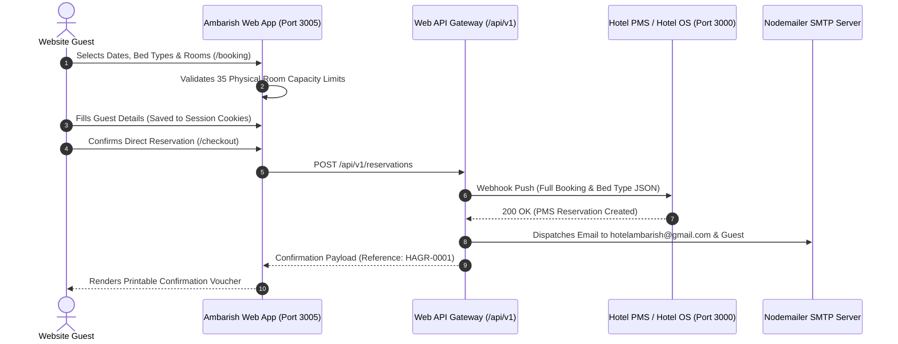

# Hotel Ambarish Grand Residency — PMS & Web API Integration Specification

Complete API reference and data schemas for integrating the **Hotel Ambarish Website** (running on port `3005`) with **Hotel OS** or any standard Hotel Property Management System (PMS) / Channel Manager (running on port `3000`).

---

## 🏗️ System Architecture & Data Flow



---

## 🏨 35 Physical Room Inventory & Capacity Matrix

The hotel features **35 physical rooms** across floors 2 to 6. The website enforces strict capacity ceilings matching this inventory:

| Room Category | Bed Type | Total Inventory | Floor-by-Floor Room Numbers |
| :--- | :--- | :--- | :--- |
| **Double Deluxe Room** | **King Bed** | **10 Rooms** | **Fl 2:** 206, 207 <br> **Fl 3:** 303, 304, 305, 306 <br> **Fl 4:** 404, 405, 406 <br> **Fl 5:** 501 |
| **Double Deluxe Room** | **Twin Beds** | **15 Rooms** | **Fl 3:** 301, 302, 308, 310, 311 <br> **Fl 4:** 401, 402, 403, 408, 409, 410, 411 <br> **Fl 5:** 504, 505, 506 |
| **Executive Room** | **King Bed** | **3 Rooms** | **Fl 5:** 503 <br> **Fl 6:** 604, 605 |
| **Executive Room** | **Twin Beds** | **5 Rooms** | **Fl 3:** 309 <br> **Fl 6:** 601, 602, 606, 607 |
| **Presidential Suite** | **King Bed** | **2 Rooms** | **Fl 5:** 502, 507 |
| **Total Hotel Inventory** | — | **35 Rooms** | Floors 2, 3, 4, 5, 6 |

---

## 🔌 API Endpoints Reference

### 1. Create Confirmed Direct Reservation
**`POST /api/v1/reservations`**

Triggered automatically upon checkout submission. Dispatches email alerts and forwards the reservation to PMS.

#### Request Headers
```http
Content-Type: application/json
```

#### Request Payload Schema
```json
{
  "roomSlug": "deluxe-room",
  "roomName": "Double Deluxe Room",
  "ratePlanCode": "EP",
  "ratePlanName": "European Plan (Room Only)",
  "bookedRooms": [
    {
      "roomSlug": "deluxe-room",
      "roomName": "Double Deluxe Room",
      "categoryCode": "DLX",
      "bedType": "King Bed",
      "ratePlanCode": "EP",
      "ratePlanName": "European Plan (Room Only)",
      "pricePerNight": 2000,
      "quantity": 1
    },
    {
      "roomSlug": "deluxe-room",
      "roomName": "Double Deluxe Room",
      "categoryCode": "DLX",
      "bedType": "Twin Bed",
      "ratePlanCode": "CP",
      "ratePlanName": "Continental Plan (With Breakfast)",
      "pricePerNight": 2400,
      "quantity": 1
    }
  ],
  "checkIn": "2026-09-10",
  "checkOut": "2026-09-12",
  "nights": 2,
  "rooms": 2,
  "adults": 4,
  "children": 1,
  "bookingType": "INDIVIDUAL",
  "guestName": "Bijesh Sharma",
  "guestEmail": "bijesh@example.com",
  "guestPhone": "9876543210",
  "guestCity": "Guwahati",
  "guestGstin": "18AAAAA0000A1Z5",
  "companyName": "Sharma Enterprises",
  "specialRequests": "Higher floor requested, quiet corner room",
  "promoCode": "DIRECT10",
  "discountAmount": 880,
  "baseAmount": 7920,
  "taxAmount": 396,
  "totalAmount": 8316,
  "paymentMethod": "PAY_AT_HOTEL",
  "paymentId": "PAY_AT_HOTEL"
}
```

#### Field Definitions
| Field | Type | Description |
| :--- | :--- | :--- |
| `bookedRooms[].bedType` | `string` | `"King Bed"` or `"Twin Bed"` (selected by guest) |
| `adults` | `number` | Total adult guests (18+ yrs) |
| `children` | `number` | Total children (0-17 yrs, free of charge) |
| `baseAmount` | `number` | Net taxable base tariff after promo discount & extra pax charges |
| `taxAmount` | `number` | 5% GST (SAC Code `996311`) |
| `totalAmount` | `number` | `baseAmount + taxAmount` (final payable) |
| `paymentMethod` | `string` | `"RAZORPAY"` (Prepaid) or `"PAY_AT_HOTEL"` (Front desk settlement) |

#### Response (`200 OK`)
```json
{
  "success": true,
  "reservation": {
    "id": "res_1788239935546_o16b7",
    "bookingReference": "HAGR-0001",
    "status": "CONFIRMED",
    "roomSlug": "deluxe-room",
    "roomName": "Double Deluxe Room",
    "checkIn": "2026-09-10",
    "checkOut": "2026-09-12",
    "nights": 2,
    "rooms": 2,
    "adults": 4,
    "children": 1,
    "guestName": "Bijesh Sharma",
    "guestEmail": "bijesh@example.com",
    "guestPhone": "9876543210",
    "totalAmount": 8316,
    "createdAt": "2026-09-01T08:00:00.000Z"
  }
}
```

---

### 2. Retrieve Reservation Voucher
**`GET /api/v1/reservations?reference=HAGR-0001`**

Returns full reservation data for PMS check-in processing and printable guest voucher.

#### Response (`200 OK`)
```json
{
  "reservation": {
    "id": "res_1788239935546_o16b7",
    "bookingReference": "HAGR-0001",
    "status": "CONFIRMED",
    "guestName": "Bijesh Sharma",
    "guestPhone": "9876543210",
    "guestEmail": "bijesh@example.com",
    "checkIn": "2026-09-10",
    "checkOut": "2026-09-12",
    "nights": 2,
    "rooms": 2,
    "adults": 4,
    "children": 1,
    "bookedRooms": [
      {
        "roomSlug": "deluxe-room",
        "roomName": "Double Deluxe Room",
        "categoryCode": "DLX",
        "bedType": "King Bed",
        "ratePlanCode": "EP",
        "ratePlanName": "European Plan (Room Only)",
        "pricePerNight": 2000,
        "quantity": 1
      },
      {
        "roomSlug": "deluxe-room",
        "roomName": "Double Deluxe Room",
        "categoryCode": "DLX",
        "bedType": "Twin Bed",
        "ratePlanCode": "CP",
        "ratePlanName": "Continental Plan (With Breakfast)",
        "pricePerNight": 2400,
        "quantity": 1
      }
    ],
    "baseAmount": 7920,
    "taxAmount": 396,
    "totalAmount": 8316,
    "paymentMethod": "PAY_AT_HOTEL",
    "createdAt": "2026-09-01T08:00:00.000Z"
  }
}
```

---

### 3. Banquet & Meeting RFP Enquiry API
**`POST /api/v1/events/enquiry`**

Submitted when a corporate planner or event host requests a banquet quote.

#### Request Payload
```json
{
  "eventType": "Corporate Conference / Seminar",
  "eventDate": "2026-10-20",
  "attendees": 60,
  "seatingLayout": "Theater / Auditorium",
  "name": "Pranab Barua",
  "email": "pranab@company.com",
  "phone": "9864012345",
  "notes": "Projector, wireless microphones, and morning high tea with executive buffet lunch required."
}
```

#### Response (`200 OK`)
```json
{
  "success": true,
  "delivered": true,
  "recipient": "hotelambarish@gmail.com",
  "message": "Enquiry successfully logged and dispatched."
}
```

---

## ⚙️ Real-Time PMS Sync Configuration

In `.env.local`:
```env
# Forward all confirmed website reservations directly into Hotel OS (Port 3000)
PMS_WEBHOOK_URL=http://localhost:3000/api/v1/reservations
PMS_API_SECRET=your_secret_token_here

# Automated Management & Guest Email Alerts
NOTIFICATION_EMAIL=hotelambarish@gmail.com
SMTP_HOST=smtp.gmail.com
SMTP_PORT=587
SMTP_USER=hotelambarish@gmail.com
SMTP_PASS=your_gmail_app_password
```

---

## 🍪 Session Cookies Specification

| Cookie Name | Scope | Lifetime | Purpose |
| :--- | :--- | :--- | :--- |
| `ambarish_guest_profile` | `Path=/; SameSite=Lax` | 7 Days | Stores guest contact & billing details (`name`, `email`, `phone`, `city`, `gstin`, `companyName`, `specialRequests`) to prefill checkout automatically. |
| `ambarish_stay_params` | `Path=/; SameSite=Lax` | 7 Days | Stores active stay filters (`checkIn`, `checkOut`, `adults`, `children`, `rooms`, `promoCode`) across pages. |
